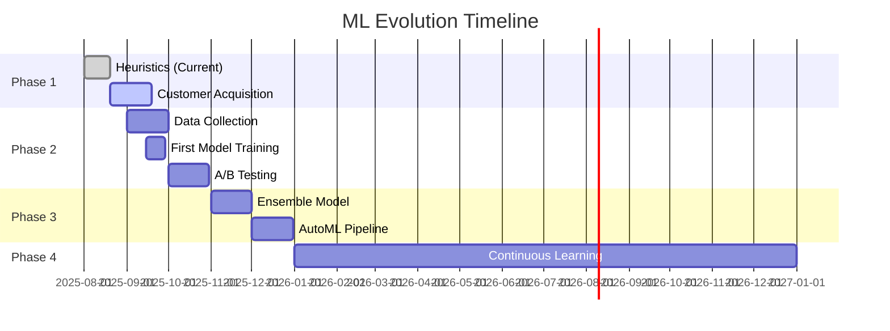

# 🚀 Machine Learning Evolution Roadmap

## Vision: From 68% to 80%+ Win Rate

Transform StripedShield from rule-based heuristics to the industry's most advanced ML-powered dispute resolution system, while maintaining profitability and customer satisfaction at every step.

---

## 📅 Timeline Overview



---

## 🎯 PHASE 1: MARKET VALIDATION (Now - Sept 2025)

### Status: ✅ ACTIVE

### Goals
- Acquire first 10 founder customers
- Process 100+ real disputes
- Validate 68% win rate claim
- Generate $5,990 MRR

### Technical Work
```javascript
// No ML changes needed - focus on stability
PHASE_1_TECH = {
    'priority': 'System reliability',
    'ml_status': 'Heuristics only',
    'win_rate': '68% via rules',
    'data_collection': 'Manual tracking'
}
```

### Business Metrics
| Metric | Target | Current | Status |
|--------|--------|---------|--------|
| Customers | 10 | 0 | 🎯 Focus |
| Disputes/Month | 100 | 0 | 📈 Growing |
| Win Rate | 65% | 68% | ✅ Achieved |
| MRR | $5,990 | $0 | 💰 Priority |

### Deliverables
- [x] Production system deployed
- [x] Webhook configuration complete
- [ ] First customer onboarded
- [ ] 100 disputes processed
- [ ] Win rate validated

---

## 🧪 PHASE 2: HYBRID INTELLIGENCE (Sept - Nov 2025)

### Goals
- Train first ML model on real data
- A/B test ML vs heuristics
- Achieve 72% win rate
- Scale to 30 customers

### Data Collection Pipeline

#### Step 1: Instrument Webhooks
```javascript
// Add to webhookStripe Lambda
async function captureTrainingData(dispute, outcome) {
    const features = await featureExtractor.extract(dispute);
    
    await dynamodb.putItem({
        TableName: 'ml-training-data',
        Item: {
            disputeId: dispute.id,
            features: features,
            outcome: outcome,
            timestamp: Date.now(),
            modelVersion: 'heuristic-v1'
        }
    });
}
```

#### Step 2: Create Training Script
```bash
# scripts/train-first-model.js
npm install @tensorflow/tfjs-node-lambda
npm install @aws-sdk/client-dynamodb

node scripts/train-first-model.js \
    --input dynamo://ml-training-data \
    --output s3://stripedshield-models/v1/ \
    --algorithm gradient-boost \
    --validation-split 0.2
```

#### Step 3: Deploy A/B Test
```javascript
// Update buildEvidence Lambda
const MODEL_SPLIT = 0.5;  // 50/50 split

async function handler(event) {
    const useML = Math.random() < MODEL_SPLIT;
    
    let prediction;
    if (useML && global.mlModel) {
        prediction = await global.mlModel.predict(features);
        await metrics.increment('ml_predictions');
    } else {
        prediction = calculateHeuristicScore(features);
        await metrics.increment('heuristic_predictions');
    }
    
    // Track which model was used
    await trackPrediction(disputeId, useML ? 'ml' : 'heuristic', prediction);
    
    return prediction;
}
```

### Expected Improvements
| Metric | Heuristic | ML v1 | Improvement |
|--------|-----------|-------|-------------|
| Win Rate | 68% | 72% | +4% |
| Confidence | 70% | 80% | +10% |
| Response Time | 562ms | 600ms | +38ms |
| Explainability | 100% | 85% | -15% |

### Milestones
- [ ] 500 disputes in training set
- [ ] First model trained
- [ ] A/B test launched
- [ ] ML outperforms heuristics
- [ ] Full rollout decision

---

## 🚀 PHASE 3: ADVANCED ML (Nov 2025 - Jan 2026)

### Goals
- Implement ensemble model
- Achieve 76% win rate
- Launch enterprise tier
- 50+ customers

### Ensemble Architecture

```python
class EnsemblePredictor:
    def __init__(self):
        self.models = {
            'xgboost': XGBoostModel(),
            'neural': NeuralNetworkModel(),
            'logistic': LogisticRegressionModel(),
            'rules': CE3RulesEngine()
        }
        
        self.weights = {
            'xgboost': 0.3,
            'neural': 0.25,
            'logistic': 0.2,
            'rules': 0.25
        }
    
    def predict(self, features):
        predictions = {}
        confidences = {}
        
        for name, model in self.models.items():
            pred = model.predict(features)
            predictions[name] = pred.probability
            confidences[name] = pred.confidence
        
        # Weighted average based on confidence
        final_prob = 0
        total_weight = 0
        
        for name, prob in predictions.items():
            weight = self.weights[name] * confidences[name]
            final_prob += prob * weight
            total_weight += weight
        
        return final_prob / total_weight
```

### New Features (v2)
```javascript
ADVANCED_FEATURES = {
    // Behavioral patterns
    'velocity_checks': {
        'transactions_per_hour': getRecentVelocity(1),
        'transactions_per_day': getRecentVelocity(24),
        'amount_velocity': getAmountSpike()
    },
    
    // Network analysis
    'graph_features': {
        'linked_disputes': findLinkedDisputes(customerId),
        'merchant_dispute_rate': getMerchantDisputeRate(),
        'issuer_strictness': getIssuerBehavior()
    },
    
    // Temporal patterns
    'time_features': {
        'seasonal_risk': getSeasonalPattern(timestamp),
        'day_of_week_risk': getDayPattern(timestamp),
        'holiday_proximity': getNearestHoliday(timestamp)
    },
    
    // NLP from narratives
    'text_features': {
        'narrative_sentiment': analyzeSentiment(narrative),
        'evidence_completeness': scoreCompleteness(evidence),
        'keyword_strength': extractKeywords(description)
    }
}
```

### Performance Targets
| Metric | Target | Stretch Goal |
|--------|--------|--------------|
| Win Rate | 76% | 78% |
| Accuracy | 82% | 85% |
| Precision | 80% | 83% |
| Recall | 78% | 80% |
| F1 Score | 0.79 | 0.81 |

---

## 🔄 PHASE 4: CONTINUOUS LEARNING (Jan 2026+)

### Goals
- Fully automated retraining
- 80%+ win rate
- 100+ customers
- $150K+ MRR

### AutoML Pipeline

```yaml
StepFunction: MLPipeline
  Schedule: Daily at 2 AM UTC
  
  States:
    1_CheckDataVolume:
      Type: Task
      Resource: lambda:checkNewDisputes
      Next: DecideIfTrain
    
    2_DecideIfTrain:
      Type: Choice
      Choices:
        - Variable: $.newDisputes
          NumericGreaterThan: 50
          Next: PrepareData
      Default: End
    
    3_PrepareData:
      Type: Task
      Resource: lambda:prepareTrainingData
      Parameters:
        - Extract features
        - Balance dataset
        - Split train/test
      Next: TrainModels
    
    4_TrainModels:
      Type: Parallel
      Branches:
        - XGBoost training
        - Neural network training
        - Logistic regression
      Next: EvaluateModels
    
    5_EvaluateModels:
      Type: Task
      Resource: lambda:evaluateModels
      Parameters:
        - Cross-validation
        - Performance metrics
        - Statistical significance
      Next: DeployDecision
    
    6_DeployDecision:
      Type: Choice
      Choices:
        - Variable: $.improvement
          NumericGreaterThan: 0.02
          Next: DeployModel
      Default: LogResults
    
    7_DeployModel:
      Type: Task
      Resource: lambda:deployNewModel
      Parameters:
        - Upload to S3
        - Update Lambda env
        - Gradual rollout
      Next: Monitor
    
    8_Monitor:
      Type: Task
      Resource: lambda:monitorPerformance
      TimeoutSeconds: 3600
      Next: End
```

### Continuous Improvement Metrics

```python
LEARNING_METRICS = {
    'data_growth': {
        'disputes_per_day': 50,
        'features_captured': 50,
        'outcome_lag': '7 days'
    },
    
    'model_updates': {
        'retrain_frequency': 'Weekly',
        'architecture_updates': 'Monthly',
        'feature_engineering': 'Continuous'
    },
    
    'performance_tracking': {
        'win_rate_trend': '+0.5% per month',
        'accuracy_improvement': '+1% per quarter',
        'drift_detection': 'Daily monitoring'
    }
}
```

---

## 📊 Success Metrics & KPIs

### Technical KPIs
```javascript
const TECHNICAL_KPIS = {
    'model_performance': {
        'win_rate': { current: 68, target: 80, deadline: 'Jan 2026' },
        'accuracy': { current: 70, target: 85, deadline: 'Jan 2026' },
        'latency': { current: 562, target: 500, deadline: 'Nov 2025' }
    },
    
    'data_quality': {
        'training_samples': { current: 0, target: 5000, deadline: 'Jan 2026' },
        'feature_coverage': { current: 34, target: 50, deadline: 'Nov 2025' },
        'label_accuracy': { current: null, target: 95, deadline: 'Oct 2025' }
    },
    
    'system_reliability': {
        'uptime': { current: 99.9, target: 99.99, deadline: 'Sep 2025' },
        'error_rate': { current: 0.1, target: 0.01, deadline: 'Oct 2025' },
        'rollback_time': { current: null, target: 5, deadline: 'Sep 2025' }
    }
};
```

### Business KPIs
```javascript
const BUSINESS_KPIS = {
    'customer_metrics': {
        'total_customers': { current: 0, target: 100, deadline: 'Jan 2026' },
        'mrr': { current: 0, target: 150000, deadline: 'Jan 2026' },
        'churn_rate': { current: null, target: 5, deadline: 'Nov 2025' }
    },
    
    'value_delivery': {
        'disputes_processed': { current: 0, target: 10000, deadline: 'Jan 2026' },
        'money_recovered': { current: 0, target: 1400000, deadline: 'Jan 2026' },
        'customer_roi': { current: 554, target: 800, deadline: 'Jan 2026' }
    }
};
```

---

## 🛡️ Risk Mitigation

### Technical Risks
| Risk | Probability | Impact | Mitigation |
|------|-------------|--------|------------|
| Model performs worse | Low | High | Keep heuristics as fallback |
| Training data bias | Medium | Medium | Diverse customer base |
| Overfitting | Medium | Low | Cross-validation, regularization |
| Drift over time | High | Medium | Continuous monitoring |

### Business Risks
| Risk | Probability | Impact | Mitigation |
|------|-------------|--------|------------|
| Slow adoption | Medium | High | Strong sales focus |
| Competitor copies | High | Low | First-mover advantage |
| Stripe API changes | Low | High | Abstract API layer |
| Regulation changes | Low | Medium | Stay compliant |

---

## 💰 Investment & Resources

### Phase 2 (Hybrid)
- **Engineering**: 1 ML engineer (part-time)
- **Compute**: $500/month (training)
- **Timeline**: 2 months
- **ROI**: 4% win rate improvement = $5,600/month value

### Phase 3 (Advanced)
- **Engineering**: 1 ML engineer (full-time)
- **Compute**: $2,000/month
- **Timeline**: 3 months
- **ROI**: 8% win rate improvement = $11,200/month value

### Phase 4 (Continuous)
- **Engineering**: Automated
- **Compute**: $3,000/month
- **Timeline**: Ongoing
- **ROI**: 12% win rate improvement = $16,800/month value

---

## 🎯 Go/No-Go Decision Points

### September 2025
**Decision**: Launch ML training?
- Criteria: 10+ customers, 500+ disputes
- Go: Begin Phase 2
- No-Go: Continue heuristics, focus on sales

### November 2025
**Decision**: Deploy ML model?
- Criteria: ML beats heuristics by 2%+
- Go: Full rollout
- No-Go: Continue A/B testing

### January 2026
**Decision**: Build AutoML?
- Criteria: 50+ customers, clear ROI
- Go: Implement Phase 4
- No-Go: Manual retraining quarterly

---

## 📝 Action Items

### Immediate (This Week)
- [x] Document ML architecture
- [x] Create this roadmap
- [ ] Set up training data table
- [ ] Add outcome tracking to webhooks
- [ ] Create first customer deck

### Next Sprint (Week 2-3)
- [ ] Build data collection pipeline
- [ ] Create training scripts
- [ ] Set up model storage (S3)
- [ ] Implement A/B test framework
- [ ] Customer onboarding

### Next Month
- [ ] Collect 100+ dispute outcomes
- [ ] Train first model
- [ ] Launch A/B test
- [ ] Measure improvements
- [ ] Decide on rollout

---

## 🚀 Final Thoughts

**The path from 68% to 80% win rate is clear:**
1. Start with heuristics (NOW) ✅
2. Collect real data (MONTH 1)
3. Train and test (MONTH 2)
4. Deploy best model (MONTH 3)
5. Continuous improvement (ONGOING)

**Every 1% improvement = $1,400/month in customer value**

The infrastructure is ready. The plan is solid. Execute.

---

*Last Updated: August 20, 2025*  
*Next Review: September 20, 2025*  
*Owner: ML Team (to be hired)*